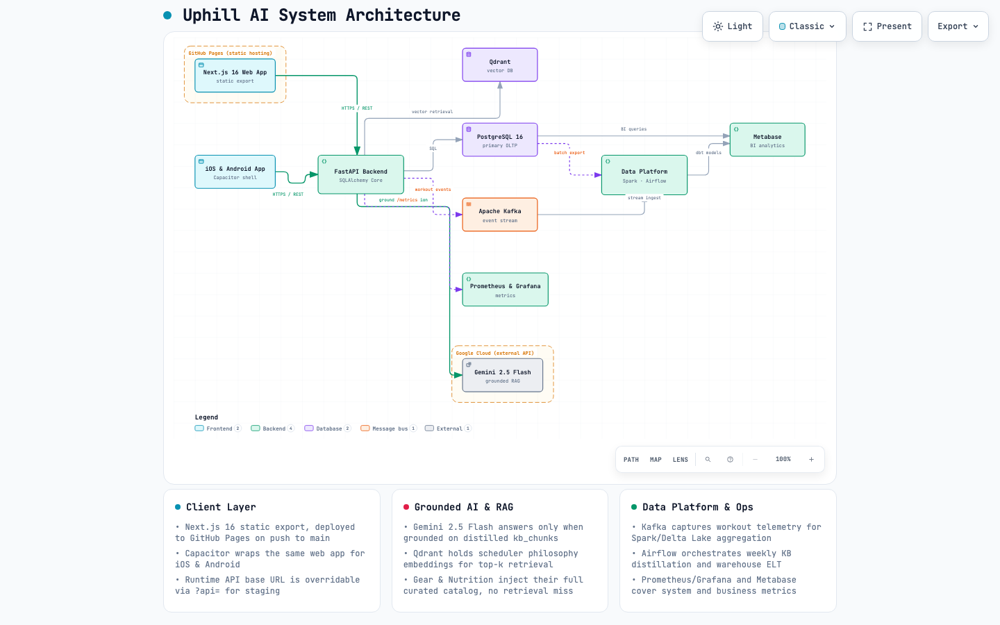

# Uphill AI 🏔️ — Science-Backed Trail, Mountain & Ultra Coaching Platform

[](https://fastapi.tiangolo.com)
[](https://nextjs.org)
[](https://capacitorjs.com)
[](https://ai.google.dev/)
[](https://qdrant.tech/)
[](https://www.postgresql.org)
[](https://airflow.apache.org)
[](https://spark.apache.org)
[](https://duckdb.org)
[](https://grafana.com)
[](#-bilingual--localization)
[](LICENSE)

> **"Train Smarter. Climb Stronger. Peak with Confidence."**  
> Uphill AI is an end-to-end, science-grounded adaptive training and race-readiness platform purpose-built for **trail, mountain, skyrunning, and ultramarathon athletes**.

---

## 📖 Table of Contents

- [Introduction](#-introduction)
  - [The Problem with Mountain Athletics](#the-problem-with-mountain-athletics)
  - [The Scientific Core & Philosophy](#the-scientific-core--philosophy)
- [Core Features](#-core-features)
  - [1. Plan Scheduler & Periodization Engine](#1-plan-scheduler--periodization-engine)
  - [2. Coach Uphill (Grounded AI Assistant)](#2-coach-uphill-grounded-ai-assistant)
  - [3. Goal Determiner & Rank Transfer](#3-goal-determiner--rank-transfer)
  - [4. Pace Strategy (Minetti Grade & Weather Engine)](#4-pace-strategy-minetti-grade--weather-engine)
  - [5. Gear Finder (Catalog-Grounded Vault)](#5-gear-finder-catalog-grounded-vault)
  - [6. Nutrition Lab (Hour-by-Hour Fueling)](#6-nutrition-lab-hour-by-hour-fueling)
  - [7. Knowledge Hub & Multimodal RAG Ingestion](#7-knowledge-hub--multimodal-rag-ingestion)
  - [8. Data Platform, Warehousing & Analytics](#8-data-platform-warehousing--analytics)
- [Uphill AI vs. The Landscape](#-uphill-ai-vs-the-landscape)
  - [Feature & Science Comparison Matrix](#feature--science-comparison-matrix)
  - [Why Traditional Running Apps (e.g., Runna) Fall Short in the Mountains](#why-traditional-running-apps-eg-runna-fall-short-in-the-mountains)
  - [Why Generic AI Chatbots (ChatGPT, Claude, Gemini) Are Dangerous for Ultra Training](#why-generic-ai-chatbots-chatgpt-claude-gemini-are-dangerous-for-ultra-training)
  - [The Uphill AI Solution: Deterministic Physics + Grounded Intelligence](#the-uphill-ai-solution-deterministic-physics--grounded-intelligence)
- [Architecture & Tech Stack](#-architecture--tech-stack)
  - [System Architecture Diagram](#system-architecture-diagram)
  - [Technology Breakdown](#technology-breakdown)
- [References & Scientific Resources](#-references--scientific-resources)
- [Bilingual & Localization](#-bilingual--localization)
- [License](#-license)

---

## 🏔️ Introduction

### The Problem with Mountain Athletics

Mountain running and ultramarathons are fundamentally different from road racing:
1. **Vertical Ascent Metabolic Load**: Climbing requires exponential metabolic work modeled by non-linear biomechanics, not flat pace splits.
2. **Eccentric Downhill Damage**: Steep descents inflict severe structural damage on quadriceps and connective tissues. Without targeted **Muscular Endurance (ME)**, legs fail hours before the cardiovascular engine does.
3. **Severe Hypoxia & Environmental Extremes**: High altitude ($>1,500\text{m}$), temperature swings ($>15^\circ\text{C}$ heat penalties), and humidity drastically impair glycogen absorption and heart rate drift.
4. **Nutrition & Hydration Failure**: The #1 cause of DNF (*Did Not Finish*) in ultra-endurance is gastrointestinal distress. Fueling requires personalized sodium ($500\text{--}1,000\text{mg/hr}$) and carb ($60\text{--}90\text{g/hr}$) strategies matched to sweat rate and gut training.

Mainstream running platforms treat running as a 2D flat sport. Generic AI chatbots hallucinate unsafe mileage ramps and make up nutritional claims. **Uphill AI bridges this divide.**

```
                           UPHILL AI SYSTEM
 ┌──────────────────────────────────────────────────────────────────────────┐
 │                                                                          │
 │   🏃 INDIVIDUAL PHYSIOLOGY       ⛰️ RACE TOPOGRAPHY & METEOROLOGY        │
 │   • Aerobic Threshold (AeT)      • GPX / Course Elevation Profiles       │
 │   • Anaerobic Threshold (AnT)    • Minetti Metabolic Energy Model        │
 │   • HR Drift & Aerobic Base      • Live Weather & Altitude Degradation   │
 │                                                                          │
 └──────────────────────────────────┬───────────────────────────────────────┘
                                    │
                                    ▼
 ┌──────────────────────────────────────────────────────────────────────────┐
 │   🧠 GROUNDED AI & DETERMINISTIC ENGINES                                 │
 │   • 80/20 Intensity Polarizer     • Muscular Endurance (ME) Protocols    │
 │   • Gemini 2.5 Flash + Qdrant RAG • DUV Ultramarathon Rank Transfer      │
 │   • 100% Curated Gear Catalog     • Dynamic Nutrition & Sodium Synthesis │
 └──────────────────────────────────┬───────────────────────────────────────┘
                                    │
                                    ▼
 ┌──────────────────────────────────────────────────────────────────────────┐
 │   📱 SEAMLESS MULTI-PLATFORM EXPERIENCE                                  │
 │   • Next.js 16 Web App           • iOS & Android (Capacitor)             │
 │   • Offline-First Execution      • English & Tiếng Việt (Bilingual)      │
 └──────────────────────────────────────────────────────────────────────────┘
```

### The Scientific Core & Philosophy

Uphill AI codifies the training methodologies of elite coaches and world-record endurance athletes:

- **Aerobic Base Building (Zone 1–2 / Below AeT)**: Based on **Scott Johnston, Steve House, and Kilian Jornet** (*Training for the Uphill Athlete*). Up to 80–90% of training stays strictly below the Aerobic Threshold (AeT) to maximize mitochondrial density, capillary vascularization, and lipid oxidation capacity while preventing *Aerobic Deficiency Syndrome (ADS)*.
- **Strict 80/20 Intensity Polarization**: Implements **Dr. Stephen Seiler's** polarization model to eliminate wasteful Zone 3 "black hole" training.
- **Muscular Endurance (ME) Conditioning**: Tailored sport-specific strength protocols (weighted step-ups, steep uphill bounds, eccentric load prep) that condition fast-twitch fibers to resist fatigue during thousands of meters of vertical gain and loss.
- **Minetti Grade-Adjusted Energetics**: Calculates energy expenditure using the landmark **Minetti et al. (2002)** metabolic cost equations, with downhill energy dissipation damping and steep gradient hiking-economy thresholds.
- **Precision Fueling & Gut Training**: Grounded in **Dr. Asker Jeukendrup's** sports nutrition frameworks, scaling exogenous carbohydrate oxidation ($60\text{--}90\text{g/hr}$) and sweat sodium replacement ($500\text{--}1,000\text{mg/hr}$) under real race conditions.

---

## 🚀 Core Features

### 1. Plan Scheduler & Periodization Engine
*Your training plan, built on the manual written by the sport's greatest.*

- **5-Zone Physiological Threshold Model**: Zones anchored directly to your **Aerobic Threshold (AeT)** and **Anaerobic Threshold (AnT)**—never inaccurate generic $220 - \text{age}$ formulas.
- **Automated 80/20 Volume Audit**: Weekly schedules are algorithmically audited to guarantee $\ge 80\%$ easy volume (Zone 1–2) and flag high-intensity overreach.
- **Dedicated Muscular Endurance (ME) Blocks**: Progresses from base aerobic volume into uphill sprints, weighted box step-ups, and downhill durability blocks.
- **Deterministic Treadmill Speed & Incline Derivation**: Converts any outdoor trail workout into an exact, mathematically equivalent treadmill speed/grade pair using grade-adjusted metabolic equations.
- **Adaptive Injury & Fatigue Swapping**: Seamlessly swaps strained muscle groups for low-impact cross-training or active recovery sessions.

### 2. Coach Uphill (Grounded AI Assistant)
*Ask anything. Receive advice grounded in peer-reviewed sports science.*

- **Gemini 2.5 Flash + Qdrant Vector Retrieval**: Chat assistant operating under strict retrieval-augmented generation (RAG) constraints.
- **Zero-Hallucination Refusal Policy**: If an inquiry falls outside verified physiological literature or curated catalogs, Coach Uphill explicitly declares its bounds rather than fabricating dangerous advice.
- **Live Athlete Context Awareness**: Seamlessly inspects your active training calendar, recent workload, target race profile, and threshold history.
- **Native Bilingual Fluency**: Instant switching between **English** and **Vietnamese (Tiếng Việt)** across all coaching advice and knowledge cards.

### 3. Goal Determiner & Rank Transfer
*Turn current baseline fitness or past races into realistic race-day targets.*

- **Terrain-Inverted Flat Pace Extraction**: Takes your past race finish time on any mountainous course and inverts the course physics (ITRA-style) to calculate your true flat-ground base fitness.
- **Asymmetric A/B/C Race Goals**:
  - **A (Ambitious)**: $+5\%$ stretch target assuming optimal weather, nutrition, and pacing execution.
  - **B (Realistic)**: Base target aligned with projected physiological adaptation.
  - **C (Safe / Contingency)**: $-8\%$ conservative safety margin accounting for mountain hazards, GI issues, or harsh weather.
- **Time-to-Race Adaptation Progression**: Models realistic fitness gains ($+0.25\%/\text{week}$, capped at $5\%$) over structured multi-week training blocks.
- **DUV & UltraSignup Rank Transfer**: Validates targets against historical finisher percentiles from global ultramarathon databases.

### 4. Pace Strategy (Minetti Grade & Weather Engine)
*Checkpoint-by-checkpoint race execution modeling.*

- **Minetti (2002) Grade Cost Multiplier**: Evaluates the metabolic cost of ascent and descent, applying downhill damping (energy absorption) and steep climbing caps.
- **Altitude Hypoxia Degradation**: Applies progressive pace penalties above $1,500\text{m}$ elevation ($\approx 1.5\%$ per $100\text{m}$ ascent).
- **Durability & Neuromuscular Decay**: Models non-linear pace degradation after $15\text{km}$ of cumulative flat-equivalent fatigue.
- **Live Meteorology Synchronization**: Fetches live race-day temperature, humidity, and precipitation data to penalize heat loads above $15^\circ\text{C}$.
- **Split Bias Optimization**: Balances even effort vs. negative split distribution while strictly preserving total target time.

### 5. Gear Finder (Catalog-Grounded Vault)
*Shoe recommendations from a verified, curated database—never AI hallucinations.*

- **100% Full-Catalog Grounding**: Injects verified specifications (stack height, drop, carbon plate, lug depth, weight, outsole compound) across top brands (*Hoka, Salomon, Nike, adidas, Asics, Altra, Norda, Saucony, Brooks, On, etc.*).
- **Terrain & Profile Matching**: Recommends footwear matched to rockiness, mud depth, race distance, runner weight, and foot strike.
- **Hallucination Validator**: Automatically rejects models or specifications not present in the verified master catalog.

### 6. Nutrition Lab (Hour-by-Hour Fueling)
*Precision sports dietitian strategies mapped to real nutrition products.*

- **Target-Driven Dynamic Math**: Formulates hourly carbohydrate ($60\text{--}90\text{g/hr}$) and sodium ($500\text{--}1,000\text{mg/hr}$) requirements based on race duration, heat index, and sweat rate.
- **Verified Product Composition**: Maps targets to real products (Maurten, Precision Fuel & Hydration, Tailwind, GU, SIS, whole foods) with exact macro/electrolyte counts.
- **Gut-Training Protocol**: Structures training-phase nutrition loading to build gut tolerance before race day.

### 7. Knowledge Hub & Multimodal RAG Ingestion
*Continuously evolving coaching wisdom curated from primary sources.*

- **Dual-Source Ingestion Engine**:
  1. **NotebookLM Deep Sweeps**: Structured extraction across 8 core endurance topics.
  2. **Autonomous Podcast Pipeline**: Crawls new *Evoke Endurance ("Evokecast")* episodes, downloads YouTube transcripts, and synthesizes bilingual knowledge cards.
- **Curated Race Course Database**: Ingests route profiles, key climbs, terrain nuances, climate warnings, and DUV result statistics.

### 8. Data Platform, Warehousing & Analytics
*Production-grade data engineering and observability built for scale.*

- **Event Streaming**: Apache Kafka capturing workout logs and telemetry streams.
- **Batch Processing**: Apache Spark 3.5 & Delta Lake pipelines for user dimension and training load aggregations.
- **Modern Data Warehouse**: DuckDB + dbt Core modeling dimensional layers (`dim_user`, `fct_workouts`, `fct_plan_generation`).
- **Workflow Orchestration**: Apache Airflow DAGs orchestrating weekly KB distillation, race results enrichment, and ELT schedules.
- **Analytics & Observability**: Metabase BI dashboards for business metrics alongside Prometheus and Grafana for backend latency and telemetry monitoring.

---

## ⚡ Uphill AI vs. The Landscape

### 1. High-Level Comparison Matrix

| Feature / Capability | Uphill AI 🏔️ | Traditional Apps (Runna, Nike, Garmin Coach) | General LLMs (ChatGPT-4o, Claude 3.7, Gemini) |
| :--- | :--- | :--- | :--- |
| **Primary Sport Domain** | **Trail, Mountain, Skyrunning & Ultras** | Road 5K, 10K, Half & Flat Marathon | General conversational text |
| **Coaching Methodology** | **House, Johnston & Jornet (*Uphill Athlete*) + Seiler 80/20** | Generic road templates & linear progression | Mixed unverified internet training blogs |
| **Threshold Anchor** | **Individualized AeT & AnT (HR Drift Test)** | Generic $220 - \text{age}$ formulas or static pace bands | Vague generic heart rate percentages |
| **Elevation & Terrain Physics** | **Minetti (2002) Curve + GPX Route Profiling** | ❌ None (assumes 2D flat road running) | ❌ Cannot calculate grade-adjusted splits |
| **Downhill & Muscular Endurance**| **✅ Dedicated ME circuits (weighted step-ups, hill bounds)**| ❌ Generic bodyweight/gym templates | ⚠️ Generic ungrounded exercise suggestions |
| **Course Checkpoint Splits** | **Grade + Altitude + Weather + Fatigue Decay** | Flat splits / Simple pace targets | Buggy arithmetic division without physics |
| **Race Goal Prediction** | **ITRA Terrain Inversion + DUV Rank Transfer** | VDOT / Riegel formula (flat road only) | Hallucinated finish times |
| **Gear Recommendation** | **100% Grounded in Curated Shoe Catalog** | Static affiliate articles / Non-adaptive | ⚠️ High hallucination (invents fake models/specs) |
| **Nutrition & Fueling Blueprint** | **Grounded in Real Products (Carb/Na+ hourly plan)** | Basic generic tips (e.g., "drink water") | ⚠️ Rough generic estimates (no catalog check) |
| **Hallucination Safeguards** | **Dual RAG + Hardcoded Physiological Bounds** | N/A (Rules-based) | ❌ Frequent hallucinations & unsafe mileage jumps |
| **Telemetry & Sensor Parsing** | **Garmin `.fit` activities & GPX route splits** | Closed ecosystem (e.g. Garmin only) | ❌ Cannot process telemetry streams |
| **Data Platform & Analytics** | **Airflow + Spark + DuckDB/dbt + Kafka + Grafana** | Proprietary closed database | Closed proprietary API |
| **Privacy & Self-Hosting** | **BYOK (Gemini API Key) + Dockerized Self-Host** | Closed subscription garden | Cloud-only subscription |
| **Bilingual Localization** | **Native English & Tiếng Việt (Bilingual RAG & UI)** | English-only (or generic machine translation) | Multilingual text (no contextual grounding) |

---

### 2. Deep-Dive: Uphill AI vs. Traditional Running Apps (Runna, NRC, Garmin Coach)

| Dimension | Uphill AI 🏔️ | Traditional Road Apps (Runna, Garmin Coach, NRC) | Why It Matters in Trail & Mountain Athletics |
| :--- | :--- | :--- | :--- |
| **Terrain & Grade Physics** | **Minetti (2002) Metabolic Model** calculates exponential climbing energy cost with downhill damping. | **Flat Pace / Distance Models** (e.g., "Run 5km @ 4:30/km"). | A 20% gradient increases metabolic cost by $>300\%$. Flat pacing in the mountains causes immediate anaerobic blowup. |
| **Aerobic Base & Thresholds** | **AeT & AnT Individual Anchors** via Heart Rate Drift Testing. Strictly enforces $\ge 80\%$ volume below AeT. | **Age-Formula Max HR ($220 - \text{age}$)** or static road pace tables. | Prevents *Aerobic Deficiency Syndrome (ADS)* and avoids the fatiguing Zone 3 "black hole" trap. |
| **Downhill Durability (ME)** | **Muscular Endurance (ME) Circuits**: Weighted box step-ups, steep uphill bounds, eccentric quad loading. | **None or Generic Core**: Basic planks, push-ups, or generic gym routines. | Mountain runners rarely fail aerobically; legs fail from eccentric quadriceps destruction during long technical descents. |
| **Race Checkpoint Splits** | **5 Stacking Physics Multipliers**: Grade, altitude hypoxia ($>1,500\text{m}$), durability decay ($>15\text{km}$), and live weather. | **Linear Split Averages**: Total target time divided evenly by course distance. | Mountain races have irregular checkpoints with varying climbs; linear pacing leads to early bonking or missed cutoffs. |
| **Precision Nutrition Planning** | **Hourly Blueprint**: Scales carbs ($60\text{--}90\text{g/hr}$) and sodium ($500\text{--}1,000\text{mg/hr}$) mapped to real verified products. | **Generic Advice**: High-level tips like "carry water and eat a gel every 45 minutes." | GI distress is the #1 cause of ultra DNFs. Fueling requires exact gut training and electrolyte replacement calibrated to heat. |
| **Footwear & Gear Matching** | **100% Curated Catalog Grounding**: Filters on lug depth, stack, drop, plate, rockiness, and runner weight. | **Static Articles**: Affiliate link lists with no personalized course or biomechanical matching. | Mountain terrain demands specific outsole rubber, lug patterns, and protection (rock plates) matched to course surface. |
| **Goal Prediction & Transfer** | **ITRA Terrain Inversion + DUV Rank Transfer**: Normalizes past races to flat pace, then projects asymmetric A/B/C goals. | **Flat VDOT / Riegel Formula**: Assumes flat road velocity and linear speed degradation. | Road formulas fail completely on courses with 5,000m+ of vertical gain; rank transfer provides empirical sanity checks. |
| **Treadmill Mode** | **Deterministic Gradient Solver**: Calculates exact treadmill speed & incline pairs equivalent to outdoor trail sessions. | **Flat Treadmill Pacing**: Uses flat treadmill speed only. | Enables high-quality mountain training for athletes with flat topography or bad weather logistics. |

---

### 3. Deep-Dive: Uphill AI vs. General AI Chatbots & Agents (ChatGPT, Claude, Gemini)

| Dimension | Uphill AI 🏔️ | General LLMs (ChatGPT-4o, Claude 3.7, Gemini 2.5 Pro) | The Danger of General LLMs in Ultra Athletics |
| :--- | :--- | :--- | :--- |
| **Progression Safety & Volume**| **Automated 80/20 & $<10\%$ Volume Audits**: Hardcoded deterministic safety ceilings. | **Unconstrained Generation**: Frequently generates $25\text{--}40\%$ weekly mileage jumps. | Rapid mileage jumps cause bone stress fractures, Achilles tendinopathy, and patellofemoral injury. |
| **Multi-Variable Split Math** | **Deterministic Python Physics**: Mathematically exact time conservation across all segments. | **Stochastic Token Prediction**: Hallucinates split times that fail to add up to total finish time. | Unreliable race pacing plans that fail basic arithmetic and ignore physical energy decay. |
| **Grounding & Refusal Guarantee**| **Dual-Engine RAG + Refusal Guard**: Refuses to answer if evidence is absent in curated knowledge base. | **Hallucination Risk**: Confidently invents non-existent shoes, fake drop specs, and unverified training methods. | Athlete receives fabricated advice masquerading as authoritative sports science. |
| **Telemetry & Sensor Parsing** | **Direct Telemetry Parsers**: Native ingestion of GPX routes, Garmin `.fit` files, and live meteorological feeds. | **No Telemetry Integration**: Cannot parse binary FIT streams or calculate GPX elevation grade profiles. | Generic LLMs cannot evaluate actual workout execution, heart rate drift, or elevation cadence. |
| **Calendar State & Adaptability**| **Persistent PostgreSQL State**: Tracks active plan, completed sessions, and adjusts future blocks. | **Stateless Ephemeral Chats**: Context lost across conversations; no persistent workout schedule. | Training requires multi-month longitudinal state tracking, not disconnected single-prompt interactions. |
| **Nutrition & Hydration Safety** | **Grounded Product Catalog**: Verified macro/sodium counts and safe physiological intake caps. | **Ungrounded Guessing**: Recommends unsafe sodium doses ($>2,500\text{mg/hr}$) or impossible carb absorption rates. | Extreme sodium overdosing causes severe gastrointestinal distress, nausea, or hyponatremia. |
| **Continuous Knowledge Updates**| **Automated Data Pipelines**: Airflow DAGs regularly scrape new *Evokecast* podcast transcripts and DUV race results. | **Static Knowledge Cutoff**: Knowledge is frozen at training date; unaware of newly released gear or race changes. | Outdated gear specs and lack of latest endurance sports science developments. |
| **Data Privacy & Ownership** | **BYOK & Self-Hostable**: Local SQLite/PostgreSQL storage with Bring-Your-Own-Key Gemini API. | **Closed Cloud Subscription**: Training data retained by LLM vendor; monthly subscription lock-in. | Athlete health metrics and training logs remain completely private and self-hosted. |

---

### 4. The Uphill AI Solution: Deterministic Physics + Grounded Intelligence

```
 ┌──────────────────────────────────────────────────────────────────────────┐
 │                       HYBRID ARCHITECTURE DESIGN                         │
 ├─────────────────────────────────────┬────────────────────────────────────┤
 │ ⚙️ DETERMINISTIC PYTHON ENGINES     │ 🧠 GROUNDED GENERATIVE AI (RAG)    │
 │ • Minetti (2002) Polynomial Physics │ • Gemini 2.5 Flash Synthesis       │
 │ • 80/20 Weekly Volume Audits        │ • Qdrant Vector Retrieval Engine   │
 │ • Individual AeT/AnT Zone Derivation│ • 100% Curated Gear & Nutrition KB │
 │ • ITRA/DUV Rank Transfer Models     │ • Zero-Hallucination Refusal Policy│
 │ • Deterministic Treadmill Solver    │ • Native Bilingual Output (EN/VI)  │
 └─────────────────────────────────────┴────────────────────────────────────┘
```

---

## 🛠️ Architecture & Tech Stack

### System Architecture Diagram

<picture>
  <source media="(prefers-color-scheme: dark)" srcset="assets/architecture/uphill-ai-architecture-dark.png">
  
</picture>

*Explorable interactive version (pan/zoom, click-to-trace, light/dark) at [`assets/architecture/uphill-ai-architecture.html`](assets/architecture/uphill-ai-architecture.html) — open it locally in a browser. Source spec: [`assets/architecture/uphill-ai-architecture.json`](assets/architecture/uphill-ai-architecture.json). The original Excalidraw sketch is preserved at [`assets/architecture/uphill_ai_architecture.excalidraw`](assets/architecture/uphill_ai_architecture.excalidraw).*

- **Client Layer**: the Next.js 16 static export (deployed to GitHub Pages) and the Capacitor-wrapped iOS/Android app both talk to the FastAPI backend over HTTPS/REST.
- **Backend**: FastAPI + SQLAlchemy Core fronts the deterministic physics engines (Minetti grade/altitude/weather model, 80/20 auditor, goal/rank-transfer estimator) and issues SQL to PostgreSQL, vector retrieval to Qdrant, grounded generation calls to Gemini 2.5 Flash, workout events to Kafka, and metrics to Prometheus.
- **AI & Vector Layer**: Qdrant holds the Scheduler's philosophy embeddings for RAG; Gear and Nutrition instead inject their full curated catalog into the Gemini prompt directly (no retrieval-miss risk).
- **Data Platform**: Kafka streams workout telemetry into Spark/Delta Lake; Airflow orchestrates the weekly KB-distillation and warehouse ELT DAGs into DuckDB/dbt.
- **Analytics & Ops**: Metabase serves BI dashboards off both PostgreSQL and the DuckDB warehouse; Prometheus + Grafana cover backend latency and system telemetry.

### Technology Breakdown

#### Frontend & Mobile Client
- **Web Framework**: Next.js 16 (App Router) with static HTML export (`output: "export"`).
- **Core Library**: React 19, TypeScript 5.
- **Mobile Runtime**: Capacitor 8.5 (`@capacitor/ios`, `@capacitor/android`, `@capacitor/haptics`, `@capacitor/local-notifications`).
- **Styling**: Tailwind CSS v4 + custom HSL design tokens for rich light/dark themes.
- **State Management**: Centralized React `AppContext` with offline persistence.

#### Backend & Core Engines
- **Web Framework**: FastAPI, Uvicorn (ASGI).
- **Database Access**: SQLAlchemy Core with parameterized SQL queries (high performance, SQL-injection safe, zero heavy ORM overhead).
- **Database Migrations**: Alembic + idempotent `init_db()` startup self-migration.
- **Telemetry Parsers**: `gpxpy` for GPX elevation splits, `fitparse` for Garmin `.fit` activity streams.
- **Physics Models**: Minetti metabolic cost equations, altitude exponential degradation curve, durability decay multiplier, weather heat index penalty.

#### AI, Vector Search & RAG
- **LLM**: Google Gemini 2.5 Flash (`gemini-2.5-flash`).
- **Vector Database**: Qdrant (`gemini-embedding-2` embeddings, collection `uphill_kb_scheduler`).
- **Web Discovery & Crawling**: Tavily Search API for continuous shoe catalog and nutrition catalog updates.
- **Podcast Processing**: `youtube-transcript-api` + Tavily crawler for *Evoke Endurance* podcast transcript synthesis.

#### Data Platform & Observability
- **Event Streaming**: Apache Kafka 3.7 (Docker Kraft cluster).
- **Batch Processing**: Apache Spark 3.5 with Delta Lake.
- **Data Warehousing**: DuckDB + dbt Core for ELT transformations.
- **Workflow Orchestration**: Apache Airflow 2.9 (LocalExecutor, automated weekly distillation DAGs).
- **Metrics & Telemetry**: Prometheus auto-instrumented via `prometheus-fastapi-instrumentator`, Node Exporter, Grafana OSS.
- **Business Intelligence**: Metabase BI running on custom glibc Debian image with DuckDB native driver.

---

## 📚 References & Scientific Resources

The algorithms and coaching guardrails in Uphill AI are directly sourced from the following literature:

1. **House, S., Johnston, S., & Jornet, K. (2019)**. *Training for the Uphill Athlete: A Manual for Mountain Runners and Ski Mountaineers*. Patagonia Books.  
   *(Core methodology for aerobic base building, AeT/AnT threshold modeling, and Muscular Endurance protocols).*
2. **Minetti, A. E., Moia, C., Roi, G. S., Susta, D., & Ferretti, G. (2002)**. *Energy cost of walking and running at extreme uphill and downhill gradients*. Journal of Applied Physiology, 93(3), 1039-1046.  
   *(Metabolic cost polynomial curve used in Pace Strategy).*
3. **Seiler, S. (2010)**. *What is best practice for training characteristics and physiological progressions in endurance athletes?* International Journal of Sports Physiology and Performance.  
   *(The 80/20 polarized intensity distribution framework).*
4. **Jeukendrup, A. (2014)**. *A step towards personalized sports nutrition: carbohydrate intake during exercise*. Sports Medicine, 44(Suppl 1), 25-33.  
   *(Exogenous carbohydrate oxidation limits and gut-training protocols).*
5. **San-Millán, I., & Brooks, G. A. (2018)**. *Assessment of Metabolic Flexibility and Skeletal Muscle Mitochondrial Capacity in Endurance Athletes*. Sports Medicine, 48(2), 467-479.  
   *(Physiological rationale for Zone 2 aerobic base conditioning).*
6. **DUV Ultramarathon Statistics** & **ITRA (International Trail Running Association)**.  
   *(Historical finisher statistics, percentile benchmarking, and course difficulty index normalization).*

---

## 🌐 Bilingual & Localization

Uphill AI features first-class internationalization for English and Vietnamese:
- **UI & Navigation**: Instant toggle across all views.
- **RAG Knowledge Hub**: Structured grounding cards distilled bilingually.
- **AI Coach & Plan Output**: Workouts, coach notes, and pace descriptions generated natively in the athlete's chosen language.

---

## 📄 License

This project is licensed under the MIT License — see the [LICENSE](LICENSE) file for details.
