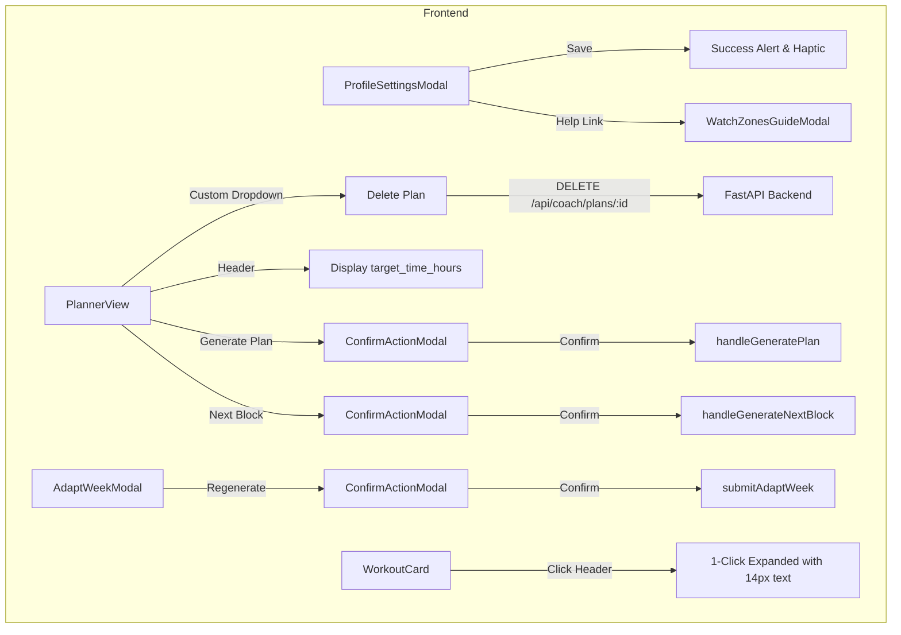

# Early Adopter Feedback & UX Improvements: Design Specification

**Date**: 2026-09-25  
**Status**: Approved / In Review  
**Scope**: Frontend UX enhancements, physiology setup guide modal, plan deletion endpoint, and action confirmation modals.

---

## 1. Overview & Context

Early adopters testing the Uphill AI trail running platform provided feedback across key areas of the training and planning workflow:
1. **Profile Settings**: Clicking "Save Settings" produces no visual feedback, leaving users uncertain if changes took effect.
2. **Physiological Thresholds (AeT, AnT)**: Runners are confused about how to identify Aerobic and Anaerobic Thresholds from their watches (Garmin, COROS, Apple Watch).
3. **Plan Management**: Users want to be able to delete obsolete or test plans from their recent plans list.
4. **Current Plan Display**: The runner's inputted race time target is not displayed on the active plan banner.
5. **Workout Execution Usability**: The "How to execute" steps require two clicks to open (card expand + "How to execute" expand) and the text is small and difficult to read on mobile.
6. **Action Confirmation**: Critical long-running or schedule-modifying actions (generating a new plan, generating next block, adapting a week) run immediately without a confirmation prompt.

---

## 2. Requirements & Detailed Design

### 2.1 Profile Save Success Feedback
- **Problem**: When `POST /api/auth/update-profile` succeeds, `ProfileSettingsModal.tsx` updates user state and closes other modals, but displays no notification.
- **Solution**:
  - Add an in-modal state `profileSaveSuccess: boolean`.
  - Render an alert banner above the form:
    - English: `"Physiology profile updated successfully!"` (`translations[lang].profile_update_success`)
    - Vietnamese: `"Cập nhật hồ sơ thể chất thành công!"`
    - Green background (`rgba(16, 185, 129, 0.1)`), green border (`#10b981`), with a check icon.
  - Call `triggerHaptic()` on native platforms.
  - Auto-clear after 4 seconds or when the user edits form fields again.

### 2.2 Watch Zones & Thresholds Helper Modal (`WatchZonesGuideModal`)
- **Problem**: AeT and AnT are essential for zone-based trail running plans, but amateur runners don't know where to look in their watch apps or how to calculate them.
- **Solution**:
  - Add a reusable modal component `frontend/src/components/WatchZonesGuideModal.tsx`.
  - Entry points: A help link / button `(? How to find your zones)` placed next to AeT/AnT in `ProfileSettingsModal.tsx` and `OnboardingWizard.tsx`.
  - Content sections:
    1. **Platform navigation guides**:
       - **Garmin**: Connect App → More (`...`) → Settings → User Settings → Heart Rate & Power Zones → Heart Rate → Zones (LT / Max HR).
       - **COROS**: COROS App → Profile → Settings → Heart Rate Zone → Threshold Heart Rate & Zone 2/Aerobic boundary.
       - **Apple Watch**: iPhone Watch App → Workout → Heart Rate Zones.
       - **Polar / Suunto / Strava**: Settings → Training Zones / Heart Rate.
    2. **Concept definitions**:
       - **AeT (Aerobic Threshold)**: Top edge of Zone 2. Conversational effort, primary energy from fat oxidation.
       - **AnT (Anaerobic / Lactate Threshold)**: Top edge of Zone 4 / LTHR. Hard sustainable 1-hour race effort.
    3. **1-Click AI Extraction Prompt**:
       - A card allowing the runner to copy a prompt directly:
         > *"I am an endurance runner. Here is a screenshot of my Heart Rate Zones and resting/max HR from my watch. Please extract: 1) AeT (Aerobic Threshold - upper boundary of Zone 2), 2) AnT (Anaerobic / Lactate Threshold - boundary of Zone 4/5), 3) Resting HR, 4) Max HR."*
       - Includes a "Copy Prompt" button with instant "Copied!" feedback.
  - Fully localized in English and Vietnamese.

### 2.3 Delete Recent Plan
- **Problem**: Test plans and outdated drafts clutter the recent plans list with no way to remove them.
- **Backend Changes**:
  - Add `DELETE /api/coach/plans/{plan_id}` in `backend/main.py`.
  - Add `delete_plan(plan_id: int, user_id: int) -> bool` in `backend/db.py`.
  - Ownership check: Verifies `plan.user_id == user["id"]` or coach acting on behalf of athlete.
  - `plans` table foreign keys (`workouts`, `scheduled_blocks`, `weekly_reviews`) already have `ON DELETE CASCADE`.
  - Returns `{"success": true, "deleted_plan_id": plan_id}`.
- **Frontend Changes**:
  - Replace the plain HTML `<select>` in `PlannerView.tsx` with a custom dropdown menu:
    - Lists recent plans with name, race date, distance.
    - Each plan has a trash icon button.
    - Clicking the trash icon triggers a confirmation dialog (`"Are you sure you want to delete this plan? This cannot be undone."` / `"Bạn có chắc chắn muốn xóa giáo án này không?"`).
    - If the deleted plan is the currently `activePlan`, set `activePlan` to null or fallback to the latest remaining plan.
    - Refresh `recentPlans`.

### 2.4 Active Plan Race Time Target Display
- **Problem**: When a runner enters a target time for their race (e.g. `8h 30m`), it is stored as `target_time_hours` in the database, but the plan summary header only displays `Goal: Time Target` without the actual number.
- **Solution**:
  - In `PlannerView.tsx`, format `activePlan.target_time_hours` when present.
  - Helper `formatTargetTime(hours: number): string` converts e.g. `8.5` to `"8h 30m"`, `0.75` to `"45m"`.
  - Render alongside Race Day:
    - English: `Race Day: 2026-11-15 | Goal: Time Target (8h 30m)`
    - Vietnamese: `Ngày đua: 2026-11-15 | Mục tiêu Thời gian (8h 30m)`
  - Also displays if target time is populated for "finish" or "optimal" goals.

### 2.5 Workout Readability & 1-Click Execution Steps
- **Problem**:
  1. Steps inside `ExecutionTimeline` are collapsed by default (`mainExpanded = false`), requiring the user to expand the card (Click 1) and then click "How to execute" (Click 2).
  2. Clicking anywhere on the card header doesn't toggle expand—only clicking the small caret icon does.
  3. Step text font size is `12.5px`, which is too small for quick reading.
- **Solution**:
  - In `WorkoutCard.tsx`:
    - Default `mainExpanded` in `ExecutionTimeline` to `true`.
    - Make the card header clickable (except on interactive buttons like checkboxes and coach edit) to toggle `expanded`.
    - Increase font size:
      - Phase steps text: from `12.5px` to `14px` with `lineHeight: 1.6`.
      - Target chips and badges: from `11px` to `12px` / `12.5px`.
      - Overview description text: from `13px` to `14px`.

### 2.6 Action Confirmation Modals (`ConfirmActionModal`)
- **Problem**: Actions that invoke LLM plan generation or modify blocks/schedules happen immediately upon clicking, risking accidental triggers.
- **Solution**:
  - Add reusable modal `frontend/src/components/ConfirmActionModal.tsx`.
  - Display:
    - Title (e.g., "Create Training Plan", "Generate Next Block", "Regenerate Week 3").
    - Plain-language explanation of what will occur.
    - Summary details (race name, weeks, target date, fatigue/notes).
    - Clear "Cancel" and "Confirm & Proceed" buttons.
  - Wire into:
    1. **Plan Generation**: Triggered on `Build Custom Calendar` submit in `PlannerView.tsx`.
    2. **Block Generation**: Triggered on `Generate Next Block` in `PlannerView.tsx`.
    3. **Adapt Week**: Triggered on `Regenerate Week X` inside `AdaptWeekModal.tsx`.

---

## 3. Data Flow & Architecture

---

## 4. Verification & Testing Strategy

1. **Backend Integration Tests**:
   - `DELETE /api/coach/plans/{plan_id}`:
     - Test deleting an existing plan owned by user (verifies 200 and cascade deletion of workouts and scheduled blocks).
     - Test IDOR security: Attempting to delete another user's plan returns 404.
     - Test unauthenticated deletion returns 401.
2. **Frontend Unit & Component Tests**:
   - `WatchZonesGuideModal`: Renders guides for Garmin/COROS/Apple and copy prompt functionality.
   - `ConfirmActionModal`: Renders action details and dispatches onConfirm / onCancel.
   - `WorkoutCard`: Renders expanded steps with single click and 14px typography.
   - `PlannerView`: Displays target time in header when `target_time_hours` is present.
3. **End-to-End Visual Verification**:
   - Verify UI rendering and screenshots on both mobile and desktop viewports.
